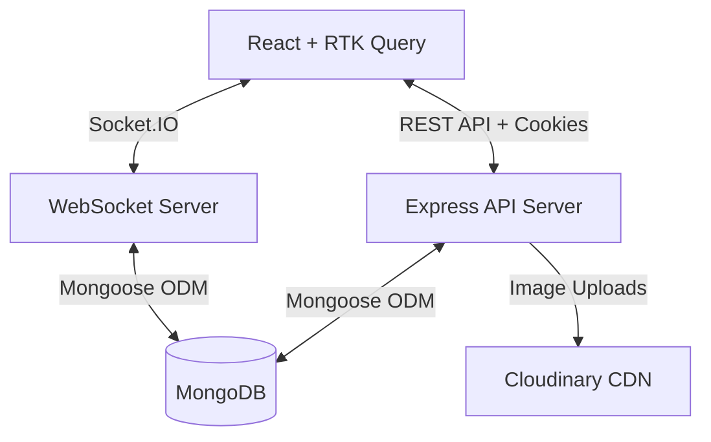

# 🏛 System Architecture

Chat Bridge is built using a modernized MERN stack (MongoDB, Express, React, Node.js) with strict TypeScript typing across the backend.

## 📦 High-Level Overview



## 💻 Client (Frontend)
- **Framework:** React 18 (Vite)
- **Styling:** Tailwind CSS + Shadcn UI components
- **State Management:** Redux Toolkit
- **Data Fetching:** RTK Query for caching and optimistic updates
- **Routing:** React Router v6

### RTK Query Strategy
The client heavily utilizes RTK Query to eliminate manual `useEffect` loading states. 
- `userApi`: Manages auth state and global user fetching.
- `conversationApi`: Caches chat lists. Optimistically updates when a new message arrives via socket.
- `messageApi`: Handles infinite scrolling and message dispatching.
- `emptySplitApi`: Uses `baseQueryWithReauth` to automatically intercept 401 Unauthorized errors and silently rotate JWT tokens via the refresh endpoint before retrying the failed request.

## ⚙️ Server (Backend)
- **Runtime:** Node.js (with `tsx` for development execution)
- **Framework:** Express.js + TypeScript
- **Database:** MongoDB with Mongoose
- **Real-time:** Socket.io

### Directory Structure
```text
server/src/
├── config/       # Database and environment initialization
├── controllers/  # Route handlers (Auth, Messages, etc)
├── lib/          # External integrations (Cloudinary, Socket.io)
├── middlewares/  # Express middlewares (Auth guard, Error handler, Rate limiters)
├── models/       # Strictly typed Mongoose schemas
├── routes/       # API route definitions
├── types/        # Global TypeScript augmentations (e.g., Express Request)
├── utils/        # Helper functions
└── validators/   # Zod schema definitions for request validation
```

## 🔐 Security Model
1. **Authentication:** 
   - Managed via dual HTTP-Only, Secure cookies (short-lived access token + long-lived refresh token).
   - Refresh tokens are hashed via bcrypt and stored in MongoDB to allow server-side revocation on logout.
   - The frontend never touches the raw JWT string, protecting against XSS.
2. **WebSockets:** 
   - The socket handshake strictly parses and verifies the access token (with a fallback to the refresh token) before accepting the connection.
3. **Protection:** 
   - `helmet` adds production-ready HTTP security headers (CSP, HSTS).
   - `express-rate-limit` prevents brute force and API spamming.
   - `xss` library sanitizes raw user inputs.
